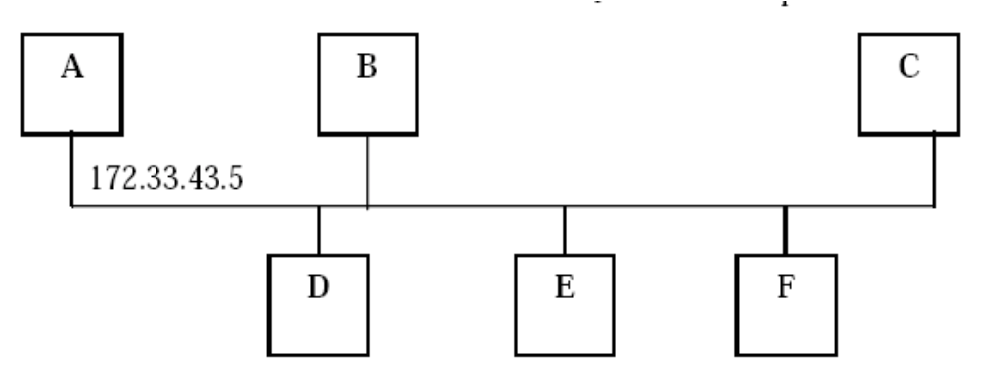

# Ut3-a3. Ejercicios Direccionamiento IP

#### 1. Convierte las siguientes direcciones a binario e indica si se trata de direcciones de tipo A, B o C. 

+ `10.0.3.2= 00001010.00000000.00000011.00000010 ; Tipo "A"`
    
    | Número | 2³ | 2² | 2¹ | 2⁰ |
    |--------|----|----|----|----|
    |        |  8 | 4  |  2 |  1 |
    |  10    |  1 | 0  |  1 |  0 |
    
    10-8=2-2=0; 0000 1010
    
    | Número | 2³ | 2² | 2¹ | 2⁰ |
    |--------|----|----|----|----|
    |        |  8 | 4  |  2 |  1 |
    |  0     |  0 | 0  |  0 |  0 |
    
    0000 0000
    
    | Número | 2³ | 2² | 2¹ | 2⁰ |
    |--------|----|----|----|----|
    |        |  8 | 4  |  2 |  1 |
    |  3     |  0 | 0  |  1 |  1 |
    
    3-2=1-1=0; 0000 0011
    
    | Número | 2³ | 2² | 2¹ | 2⁰ |
    |--------|----|----|----|----|
    |        |  8 | 4  |  2 |  1 |
    |  2     |  0 | 0  |  1 |  0 |
    
    2-2=0; 0000 0010 
    
+ `128.45.7.1 = 10000000.00100101.00000111.00000001; Tipo "B"`

    | Número | 2⁷  | 2⁶  | 2⁵  | 2⁴  | 2³ | 2² | 2¹ | 2⁰ |
    |--------|-----|-----|-----|-----|----|----|----|----|
    |        | 128 | 64  | 32  | 16  |  8 | 4  |  2 |  1 |
    |  128   |  1  | 0   | 0   | 0   |  0 | 0  |  0 |  0 |

    128-128=0; 1000 0000
    
    | Número | 2⁵  | 2⁴  | 2³ | 2² | 2¹ | 2⁰ |
    |--------|-----|-----|----|----|----|----|
    |        | 32  | 16  |  8 | 4  |  2 |  1 |
    |  45    | 1   | 0   |  0 | 1  |  0 |  1 |
 
    45-32=13-8=5-4=1-1=0; 0010 0101
 
    | Número | 2² | 2¹ | 2⁰ |
    |--------|----|----|----|
    |        | 4  |  2 |  1 |
    |  7     | 1  |  1 |  1 |
 
    7-4=3-2=1-1=0; 0000 0111
 
    | Número  | 2⁰ |
    |---------|----|
    |         |  1 |
    |  1      |  1 |
 
    1-1=0; 0000 0001
 
+ `192.200.5.4 = 11000000.11001000.00000101.00000100; Tipo "C"`

    | Número  | 2⁸   | 2⁷  | 2⁶  | 2⁵  | 2⁴  | 2³ | 2² | 2¹ | 2⁰ |
    |---------|------|-----|-----|-----|-----|----|----|----|----|
    |         |  256 | 128 | 64  | 32  | 16  |  8 | 4  |  2 |  1 |
    |  192    |   0  |  1  | 1  | 0   | 0   |  0 | 0  |  0 |  0 |
    
    192-128=64-64=0; 1100 0000 
    
    | Número  | 2⁸   | 2⁷  | 2⁶  | 2⁵  | 2⁴  | 2³ | 2² | 2¹ | 2⁰ |
    |---------|------|-----|-----|-----|-----|----|----|----|----|
    |         |  256 | 128 | 64  | 32  | 16  |  8 | 4  |  2 |  1 |
    |  200    |   0  |  1  | 1   | 0   | 0   | 1  | 0  |  0 |  0 |
    
    200-128=72-64=8-8=0; 1100 1000
    
    | Número  | 2² | 2¹ | 2⁰ |
    |---------|----|----|----|
    |         | 4  |  2 |  1 |
    |  5      | 1  |  0 |  1 |
    
    5-4=1-1=0; 0000 0101
    
    | Número  | 2² | 2¹ | 2⁰ |
    |---------|----|----|----|
    |         | 4  |  2 |  1 |
    |  4      | 1  |  0 |  0 |
    
    4-4= 0 ; 0000 0100
    
+ `51.23.32.50=00110011.00010111.00010000.00110011010; Tipo "A"`

    | Número | 2⁶  | 2⁵  | 2⁴  | 2³ | 2² | 2¹ | 2⁰ |
    |--------|-----|-----|-----|----|----|----|----|
    |        | 64  | 32  | 16  |  8 | 4  |  2 |  1 |
    |  51    | 0   | 1   | 1   |  0 | 0  |  1 |  1 |

    51-32=19-16=3-2=1-1=0; 0011 0011
    
    | Número | 2⁴  | 2³ | 2² | 2¹ | 2⁰ |
    |--------|-----|----|----|----|----|
    |        | 16  |  8 | 4  |  2 |  1 |
    |  23    | 1   |  0 | 1  |  1 |  1 |
    
    23-16=7-4=3-2=1-1: 0001 0111
    
    | Número | 2⁵  | 2⁴  | 2³ | 2² | 2¹ | 2⁰ |
    |--------|-----|-----|----|----|----|----|
    |        | 32  | 16  |  8 | 4  |  2 |  1 |
    |  32    | 1   | 0   |  0 | 0  |  0 |  0 |

    32-32=0; 0001 0000
    
    | Número | 2⁶  | 2⁵  | 2⁴  | 2³ | 2² | 2¹ | 2⁰ |
    |--------|-----|-----|-----|----|----|----|----|
    |        | 64  | 32  | 16  |  8 | 4  |  2 |  1 |
    |  51    | 0   | 1   | 1   |  0 | 0  |  1 |  0 |
    
    50-32=18-16=2-2=1; 0011 0010
    
+ `47.50.3.2=00101111.00110010.00000011.00000010; Tipo "A"`  

    | Número | 2⁵  | 2⁴  | 2³ | 2² | 2¹ | 2⁰ |
    |--------|-----|-----|----|----|----|----|
    |        | 32  | 16  |  8 | 4  |  2 |  1 |
    |  47    | 1   | 0   |  1 | 1  |  1 |  1 |
    
    47-32=15-8=7-4=3-2=1-1=0; 0010 1111
    
    | Número | 2⁵  | 2⁴  | 2³ | 2² | 2¹ | 2⁰ |
    |--------|-----|-----|----|----|----|----|
    |        | 32  | 16  |  8 | 4  |  2 |  1 |
    |  50    | 1   | 1   |  0 | 0  |  1 |  0 |
    
    50-32=18-16=2-2=0; 0011 0010
    
    | Número | 2¹ | 2⁰ |
    |--------|----|----|
    |        |  2 |  1 |
    |  3     |  1 |  1 |
    
    3-2=1-1=0; 0000 0011
    
    | Número | 2¹ | 2⁰ |
    |--------|----|----|
    |        |  2 |  1 |
    |  3     |  1 |  0 |
    
    2-2=0; 0000 0010
    
    
+ `100.90.80.70=01100100.01011010.01010000.01000110;Tipo "A"` 

    | Número | 2⁶  | 2⁵  | 2⁴  | 2³ | 2² | 2¹ | 2⁰ |
    |--------|-----|-----|-----|----|----|----|----|
    |        | 64  | 32  | 16  |  8 | 4  |  2 |  1 |
    |  100   | 1   | 1   | 0   |  0 | 1  |  0 |  0 |

    100-64=36-32=4-4=0M; 0110 0100

    | Número | 2⁶  | 2⁵  | 2⁴  | 2³ | 2² | 2¹ | 2⁰ |
    |--------|-----|-----|-----|----|----|----|----|
    |        | 64  | 32  | 16  |  8 | 4  |  2 |  1 |
    |  90    | 1   | 0   | 1   |  1 | 0  |  1 |  0 |
    
    90-64=26-16=10-8=2-2=0; 0101 1010
    
    | Número | 2⁶  | 2⁵  | 2⁴  | 2³ | 2² | 2¹ | 2⁰ |
    |--------|-----|-----|-----|----|----|----|----|
    |        | 64  | 32  | 16  |  8 | 4  |  2 |  1 |
    |  80    | 1   | 0   | 1   |  0 | 0  |  0 |  0 |
    
    80-64=16-16=0; 0101 0000
    
    | Número | 2⁶  | 2⁵  | 2⁴  | 2³ | 2² | 2¹ | 2⁰ |
    |--------|-----|-----|-----|----|----|----|----|
    |        | 64  | 32  | 16  |  8 | 4  |  2 |  1 |
    |  70    | 1   | 0   | 0   |  0 | 1  |  1 |  0 |
    
    70-64=6-4=2-2=0; 0100 0110
+ `124.45.6.1=01111100.00101101.00000110.00000001` 

    | Número | 2⁶  | 2⁵  | 2⁴  | 2³ | 2² | 2¹ | 2⁰ |
    |--------|-----|-----|-----|----|----|----|----|
    |        | 64  | 32  | 16  |  8 | 4  |  2 |  1 |
    |  124   | 1   | 1   |  1  |  1 | 1  |  0 |  0 |
    
    124-64=60-32=28-16=12-8=4-4=0; 0111 1100
    
    | Número | 2⁵  | 2⁴  | 2³ | 2² | 2¹ | 2⁰ |
    |--------|-----|-----|----|----|----|----|
    |        | 32  | 16  |  8 | 4  |  2 |  1 |
    |  45    | 1   | 0   |  1 | 1  |  0 |  1 |
   
    45-32=13-8=5-4=1-1=0; 0010 1101
    
    | Número | 2² | 2¹ | 2⁰ |
    |--------|----|----|----|
    |        | 4  |  2 |  1 |
    |  6     | 1  |  1 |  0 |
    
    6-4=2-2=0; 0000 0110
    
    | Número | 2⁰ |
    |--------|----|
    |        |  1 |
    |  1     |  1 |
    
    1-1=0; 0000 0001

#### 2. Dada la dirección de red `192.168.30.0`, indica qué máscara de subred deberías escoger para tener 4 subredes. Rellena a continuación la siguiente tabla. 

192.168.30.0
    
11000000.10101000.00011110.00000000
    
255.255.255.0     
    
11111111.11111111.11111111.00000000
    
255.255.255.192(2^2)
    
11111111.11111111.11111111.11000000
    
192.168.30.0   
    
11000000.10101000.00011110.00000000
    
192.168.30.64    
    
11000000.10101000.00011110.01000000
    
192.168.30.128
    
11000000.10101000.00011110.10000000

192.168.30.192    
    
11000000.10101000.00011110.11000000
    
    
| Número de red | Dirección de subred | Primer host | Último host |
|---------------|---------------------|-------------|-------------|
|      1        |192.168.30.0         |192.168.30.1 |192.168.30.62|
|      2        |192.168.30.64        |192.168.30.65|192.168.30.126|
|      3        |192.168.30.128       |192.168.30.129|192.168.30.190|
|      4        |192.168.30.192       |192.168.30.193|192.168.30.254|

#### 3. Dada la dirección de red `192.168.55.0`, indica qué máscara de subred deberías escoger para tener 8 subredes. Rellena a continuación la siguiente tabla.

192.168.55.0
    
11000000.10101000.00110111.00000000
    
255.255.255.0    
    
11111111.11111111.11111111.00000000
    
255.255.255.224(2^3)
    
11111111.11111111.11111111.11100000
    
192.168.55.0
    
11000000.10101000.00110111.00000000

192.168.55.32
    
11000000.10101000.00110111.00100000 

192.168.55.64
    
11000000.10101000.00110111.01000000

192.168.55.96
    
11000000.10101000.00110111.01100000
    
192.168.55.128
    
11000000.10101000.00110111.10000000
    
192.168.55.160
    
11000000.10101000.00110111.10100000
    
192.168.55.192
    
11000000.10101000.00110111.11000000
    
192.168.55.224
    
11000000.10101000.00110111.11100000
    
| Número de red | Dirección de subred | Primer host | Último host |
|---------------|---------------------|-------------|-------------|
|       1        |192.168.55.0  |192.168.55.1|192.168.55.30|
|       2        |192.168.55.32 |192.168.55.33|192.168.55.62|
|       3        |192.168.55.64 |192.168.55.65|192.168.55.94|
|       4        |192.168.55.96 |192.168.55.97|192.168.55.126|
|       5        |192.168.55.128|192.168.55.129|192.168.55.158|
|       6        |192.168.55.160|192.168.55.161|192.168.55.190|
|       7        |192.168.55.192|192.168.55.193|192.168.55.222|
|       8        |192.168.55.224|192.168.55.225|192.168.55.254|

#### 4. Dada la dirección de clase B `150.40.0.0`, indica qué máscara de subred deberías escoger para tener 4 subred. Rellena a continuación la siguiente tabla.

150.40.0.0
    
10010110.00101000.00000000.00000000
    
255.255.0.0
    
11111111.11111111.00000000.00000000
    
255.255.192.0
    
11111111.11111111.11000000.00000000
    

10010110.00101000.00000000.00000000 =150.40.0.0
    
10010110.00101000.01000000.00000000=150.40.64.0
    
10010110.00101000.10000000.00000000= 150.40.128.0
    
10010110.00101000.11000000.00000000=150.40.192.0
   

| Número de red | Dirección de subred | Primer host | Último host |
|---------------|---------------------|-------------|-------------|
|        1       | 150.40.0.0|150.40.0.1|150.40.63.254|
|        2       | 150.40.64.0|150.40.64.1|150.40.127.254|
|        3       | 150.40.128.0 |150.40.128.1 |150.40.191.254 |
|        4       | 150.40.192.0 |150.40.192.1 |150.40.254.254 |

#### 5. ¿Cuál es el intervalo decimal y binario del primer octeto para todas las direcciones `ip` clase "B" posibles? 
 
128=0101 0000 

191=1010 0000
+ ¿Qué octeto u octetos representan la parte que corresponde a la red de una dirección `ip` clase "C"? 

+ Los tres primeros octetos

¿Qué octeto u octetos representan la parte que corresponde al host de una dirección `ip` clase "A"?

+Los cuatro primero

En la  clase B el intervalo binario desde 1000000 a 1011111 
Desde  clase C el
Desde  clase A

#### 6. Completa la siguiente tabla:

| Dirección `ip` del host | Dirección clase | Dirección de red | Dirección de host | Dirección de broadcast de red | Máscara de subred por defecto |
|-----------------------|-----------------|------------------|-------------------|-------------------------------|-------------------------------|
| 216.14.55.137         |   C             |216.14.55.00      | 216.14.55.137     |216.14.55.255                  |255.255.255.0                               |
| 123.1.1.15            |A                |123.0.0.0         |123.1.1.15         |123.255.255.255                |255.0.0.0                               |
| 150.127.221.224       |B                |150.127.0.0       |150.127.221.224    |150.127.255.255                |255.255.0.0                             |
| 194.125.35.0 | C                |  194.125.35.0 |194.125.35.199|194.125.35.255|255.255.255.0                               |
| 175.12.239.244   |B       |175.12.0.0                  |175.12.239.244|175.12.255.255                      |255.255.0.0                               |

#### 7. Dada una dirección `142.226.0.15` :

+ ¿Cuál es el equivalente binario del segundo octeto?
       
      1110 0010 
      
+ ¿Cuál es la Clase de la dirección?

      Clase B 
       
+ ¿Cuál es la dirección de red de esta dirección `ip`?
    
       142.226.0.0
    
+ ¿Es ésta una dirección de host válida?
    
        sí
    
+   ¿Por qué? o ¿Por qué no? 
  
Porque no es una dirección de red de difusión ni privada.

+ ¿Cuál es la cantidad máxima de hosts que se pueden tener con una dirección de red de clase C?
    
254(2^8-2)

+ ¿Cuántas redes de clase B puede haber?

2^16
+ ¿Cuántos hosts puede tener cada red de clase B?

2^16-2

+ ¿Cuántos octetos hay en una dirección `ip`?

4

+ ¿Cuántos bits puede haber por octeto? 

8

#### 8. Determinar, para las siguientes direcciones de host `ip`, cuáles son las direcciones que son válidas para redes comerciales. Válida significa que se puede asignar a una estación de trabajo, servidor, impresora, interfaz de router, etc.

| Dirección `ip`  | ¿La dirección es válida? | ¿Por qué? |
|-----------------|--------------------------|-----------|
| 150.100.255.255 |      no                  | Ya que esta sería la dirección del broadcoast           |
| 175.100.255.18  |      sí                  | Porque es una red de clase B y no corresponde ni a una dirección de red ni de broadcast           |
| 100.0.0.23      |       sí                   | Porque es una red de clase A y esta no corresponde ni a una dirección de red no de broadcast.          |
| 188.258.221.176 |          No                |    Porque en el segundo octeto pone 258        |
| 127.34.25.189   |              No            | Porque el 127 está red está reservada          |
| 224.156.217.73  |              No.            |   Porque es de una clase reservada D y E
         |

#### 9. Completa la siguiente tabla:

|  `ip`         | Máscara | Subred | Broadcast |
|---------------|---------|--------|-----------|
| 192.168.1.130 |255.255.255.128|192.168.1.128 |192.168.1.255 |
| 10.1.1.3      |255.255.0.0  |10.1.0.0 |10.1.255.255 |
| 10.1.1.8      |255.255.0.0|10.1.0.0 |10.1.255.255 |
| 200.1.1.23    |255.0.0.0 |220.0.0.0 |220.255.255.255 |
| 172.168.8.48   |255.255.248.0        |172.16.8.0        |172.16.15.255    |
| 172.16.8.48   |255.255.255.224       |172.16.8.32|172.16.8.63           |

#### 10. Asignar direcciones `ip` válidas a las interfaces de red (interfaz de red = tarjeta de red) que les falte para conseguir que exista comunicación entre los host A, B, C, D, E y F. La máscara en todos los casos será `255.255.224.0`. Justifica la respuesta.

    
Como ya nos da host A una ip 172.33.43.5 de clase B lo que tenemos que hacer para averiguar la subred seria un and entre el trecer octeto 224 y 43 . 

AND
    
 1 1 1 0 0 0 0 0
    
 0 0 1 0 1 0 1 1 

.......................................
    
0 0 0 1 0 0 0 0 = 32
    
Y la ip de subred sería 172.33.32.0 .

host B. 172.33.32.1
    
host C. 172.33.32.2
    
host D. 172.33.32.3
    
host E. 172.33.32.4
    
host F. 172.33.32.5
   

#### 11. Tu empresa tiene una dirección de red de Clase C de `200.10.57.0` .Desea subdividir la red física en 3 subredes.
+ Indica una máscara que permita dividir la red de clase C (al menos) en tres subredes.

     255.255.255.192

+ ¿Cuántos hosts (ordenadores) puede haber por subred?
    
      2^6 -2
    
+ ¿Cuál es la dirección de red y la dirección de broadcast de cada una de las 3 subredes creadas?
    
     | Dirección de red | Dirección de Broadcast |
     |------------------|------------------------|
     |200.10.57.0       | 200.10.57.63           |
     |200.10.57.64      | 200.10.57.127          |
     |200.10.57.128     | 200.10.57.191          |
     
#### 12. Se desea subdividir la dirección de red de clase C de `200.10.57.0` en 4 subredes. Responde a las siguientes preguntas:

+ ¿Cuál es el equivalente en números binarios de la dirección de red de clase C `200.10.57.0` de este ejercicio?
    
        11001000.00001010.00111001.00000000
    
    
+ ¿Cuál(es) es (son) el (los) octeto(s) que representa(n) la porción de red y cuál(es) es (son) el (los) octeto(s) que representa(n) la porción de host de              esta dirección de red de clase C?
 
        Los tres primeros octetos son de red y el último octeto sería el host tal que así red.red.red.host . 
        
+ ¿Cuántos bits se deben pedir prestados a la porción de host de la dirección de red para poder suministrar 8 subredes?
    
         2^3-2. Se deben pedir prestado tres bits. 
    
+ ¿Cuál será la máscara de subred (utilizando la notación decimal) basándose en la cantidad de bits que se pidieron prestados en el paso 3?
    
         255.255.255.224
    
+ ¿Cuál es el equivalente en números binarios de la máscara de subred a la que se hace referencia anteriormente?
    
     11111111.11111111.1111111.11100000

#### 13. Teniendo en cuenta la dirección `ip` del ejercicio anterior (`200.10.57.0`) completa la siguiente tabla para cada una de las posibles subredes que se pueden crear pidiendo prestados 3 bits para subredes al cuarto octeto (octeto de host). Identifica la dirección de red, la máscara de subred, el intervalo de direcciones `ip` de host posibles para cada subred, la dirección de broadcast para cada subred.

|  Subred | Dirección de subred | Primer host      | Último host      |
|---------|---------------------|------------------|------------------|
| 1       | 200.10.57.0         |200.10.57.1       |200.10.57.30      |
| 2       | 200.10.57.32        |200.10.57.33      |200.10.57.62      |
| 3       | 200.10.57.64        |200.10.57.65      |200.10.57.94      |
| 4       | 200.10.57.96        |200.10.57.97      |200.10.57.126     |
| 5       | 200.10.57.128       |200.10.57.129     |200.10.57.158     |
| 6       | 200.10.57.160       |200.10.57.161     |200.10.57.190     |
| 7       | 200.10.57.192       |200.10.57.193     |200.10.57.222     |
| 8       | 200.10.57.224       |200.10.57.225     |200.10.57.254     |

#### 14. Completa la siguiente tabla:

| `ip`          | Máscara         | Subred        | Broadcast     | Número hosts |
|---------------|-----------------|---------------|---------------|--------------|
| 192.168.1.130 | 255.255.255.128 | 192.168.1.128 | 192.168.1.255 | 128-2        |
| 200.1.17.15   | 255.255.255.0   | 200.1.17.0    | 200.1.17.255  | 254          |
| 133.32.4.61   | 255.255.255.224 | 133.32.4.32   |133.32.4.63    | 32-2         |
| 132.4.60.99   | 255.255.0.0     | 132.4.0.0     |132.4.255.255  |2^16-2        |
| 222.43.15.41  | 255.255.255.0   | 222.43.15.0   | 222.43.15.255 |2^8-2         |
| 192.168.0.1   | 255.255.255.192 | 192.168.0.0   | 192.168.0.63  |32-2          |

#### 15. Responde a las siguientes preguntas:

+ Si tenemos una red `147.84.32.0` con máscara de red `255.255.255.252`, indica la dirección de broadcast, la de red y la de los posibles nodos de la red.

Primero lo que se haría sería averiguar la dirección broadcast al ser la máscara 255.255.255.252 sería una subred de la Clase C se averigua haciendo una and      entre el último octeto de la direccion de ambas

147.84.32.  0000 0000 (dirección de red)

255.255.255.1111 1100 (máscara de red)

.......................................................................................................

147.84.32. 0000 00 11= 147.84.32.3( broadcast ) 
    
(nodos)
147.64.32.1

147.64.32.2
      
        
 + La red `192.168.0.0`, ¿de qué clase es?

     Clase C

+ Escribe el rango de direcciones `ip` que pertenecen a la subred definida por la dirección `140.220.15.245` con máscara `255.255.255.240`.

      Sería una subred de la clase c para saber la subred a la que pertenece hacemos una and entre la dirección que nos dan (140.220.15.245) y la máscara(255.255.255.240) y así averiguaremos la subred.   
      
      140.220.15. 1111 0101
      
      255.255.255.1111 0000

    .......................................................................................................
    
    140.220.15.1111 0000 = 240 (dirección de red)
    
    (nodos)
    
    140.220.15.241
    
    142.220.15.254
    
    142.220.15.255(Broadcast)

+ Una red de clase B en Internet tiene una máscara de subred igual a `255.255.240.0`. ¿Cuál es el máximo de nodos por subred?       
    
    Es una red de clase B la cuál coge 4 bits para la subred y por lo tanto los 12 bits restantes son para los nodos/host. 

#### 16. Calcular la dirección de red y la dirección de broadcast (difusión) de las máquinas con las siguientes direcciones IP y máscaras de subred (si no se especifica, se utiliza la máscara por defecto).

+ `18.120.16.250` /255.0.0.0 / 18.0.0.0 / 18.255.255.255
+ `18.120.16.255 / 255.255.0.0` / D.red:18.120.0.0/D.broadcast:18.120.255.255
+ `155.4.220.39` /255.255.0.0/D.red: 155.4.0.0/D.broadcast:155.4.255.255
+ `194.209.14.33`/255.255.255.0/D.red 194.209.14.0/ D.broadcast: 194.209.14.255
+ `190.33.109.133 / 255.255.255.0`/D.red 190.33.109.0/D.broadcast:190.33.109.255
+ `190.33.109.133 / 255.255.255.128`
     
   190.33.109. 1000 0101
   
   255.255.255.1000 0000
   
   192.33.109.1000 0000= 128
   
   D.red:192.33.109.128
   
   D.broadcast:192.33.109.255
   
+ `192.168.20.25 / 255.255.255.240`
    
      192.168.20.0001 1001
      
      255.255.255.1111 0000
      
      192.168.20.0001 0000= 16
      
      D.red=192.168.20.16
      
      D.broadcast=192.168.20.255
      
+ `192.168.20.25 / 255.255.255.192`
    
    192.168.20.0001 0000
    
    255.255.255.1100 0000
    
    192.168.20.0000 0000= 0
    
    D.red=192.168.20.0
    D.broadcast=192.168.20.255
    

#### 17. Responde a las siguientes preguntas:

+ ¿Cuántos ordenadores como máximo se pueden tener en una red de clase A?
    
   2^24-2 
    
+ ¿Cuántos ordenadores como máximo se pueden tener en una red de clase B?
    
    2^16-2
    
+ ¿Cuántos ordenadores como máximo se pueden tener en una red de clase C?
    
    2^8-2
    
+ En una red de clase C con máscara `255.255.255.128`, ¿cuántos ordenadores se pueden tener en cada subred?
    
    126
    
+ En una red de clase C con máscara `255.255.255.192`, ¿cuántos ordenadores se pueden tener en cada subred?
    
    62

#### 18. Tu empresa tiene una dirección de red de Clase B de `150.10.0.0`. Desea subdividir la red física en 3 subredes.

+ Indica una máscara que permita dividir la red de clase B (al menos) en tres subredes.

    255.255.0.0
    11111111.11111111.00000000.00000000
    
    255.255.192.0
    1111 1111.1111 1111.11000000.00000000
    
    150.10.0.0
    1111 1111.1111 1111. 00000000.00000000
    
    150.10.64.0
    1111 1111.11111111.01000000.00000000
    
    150.10.128.0
    1111111.11111111.10000000.0000000
    
+ ¿Cuántos hosts puede haber por subred?
    
    2^14-2
    
+ ¿Cuál es la dirección de red y la dirección de broadcast de cada una de las 3 subredes creadas?

    | Dirección de red  | Broadcast       | 
    |-------------------|-----------------|
    | 150.10.0.0        | 150.10.63.255   | 
    | 150.10.64.0       | 150.10.127.255  |
    | 150.10.128.255    | 150.10.191.255  |

#### 19. Dada la dirección de clase B `120.32.0.0`, indica qué máscara de subred deberías escoger para tener 4 subredes. Rellena a continuación la siguiente tabla.

    
| Número de red | Dirección de subred | Primer host   | Último host    |
|---------------|---------------------|---------------|----------------|
| 1             | 120.32.0.0          | 120.32.0.1    | 120.32.63.254  |
| 2             | 120.32.64.0         | 120.32.64.1   | 120.32.127.254 |
| 3             | 120.32.128.0        | 120.32.128.1  | 120.32.191.254 |
| 4             | 120.32.192.0        | 120.32.192.1  | 120.32.255.254 |

#### 20. Responde a las siguientes preguntas:

+ Si tenemos una red `150.84.32.0` con máscara de red `255.255.255.224`, indica la dirección de broadcast, la de red y la de los posibles nodos de la red.
    
    D.red=150.24.32.0
   
    D.broadcast=150.24.32.31 porque al coger el ultimo octeto 3 bits el resto son para los nodos o hots
    
    D.nodos de red
    
    150.24.32.1
    
    150.24.32.30
    
+ La red `192.168.0.0`, ¿de qué clase es? 

    Tipo C

+ Escribe el rango de direcciones `ip` que pertenecen a la subred definida por la dirección  `150.84.32.245` con máscara `255.255.255.240`.
    
Sería una subred de la clase c para saber la subred a la que pertenece hacemos una and entre la dirección que nos dan (150.84.32.245) y la         máscara(255.255.255.240) y así averiguaremos la subred.
      
      150.84.32. 1111 0101
      
      255.255.255.1111 0000
      
     ..................................................................................... 
      
      150.84.32.1111 0000=240

 150.84.32.240 (dirección de red)

(nodos)
    
 150.84.32.241  al 150.84.32.254
  
+ Una red de clase B en Internet tiene una máscara de subred igual a `255.255.240.0`. ¿Cuál es el máximo de nodos por subred?
    
2^12-2

