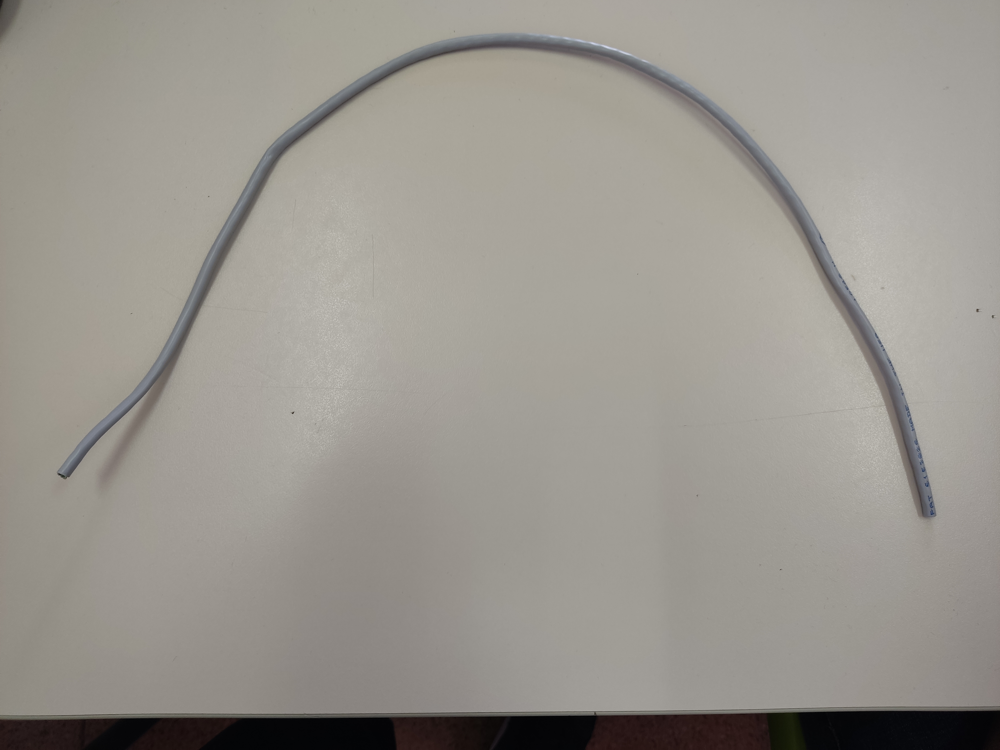
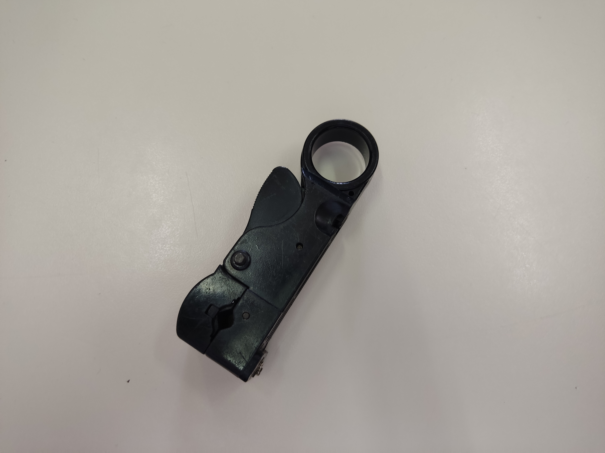
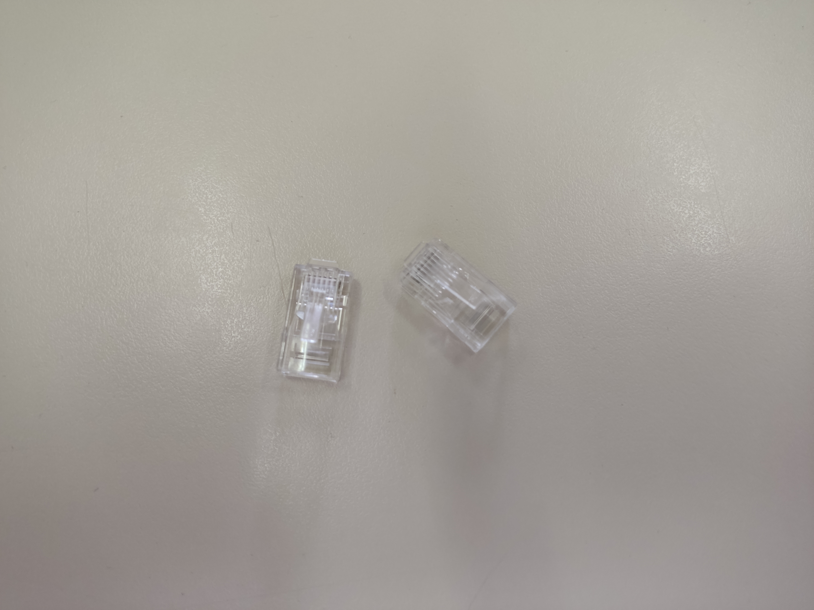
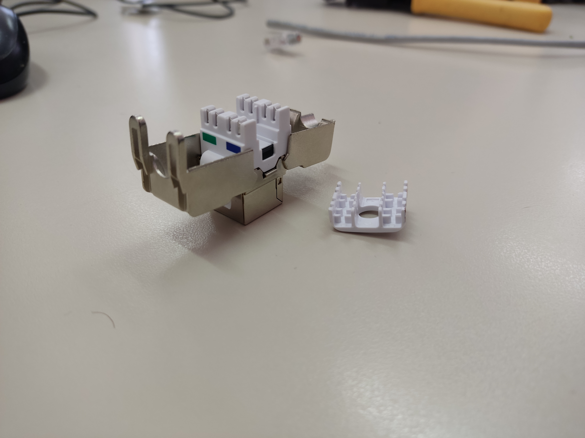
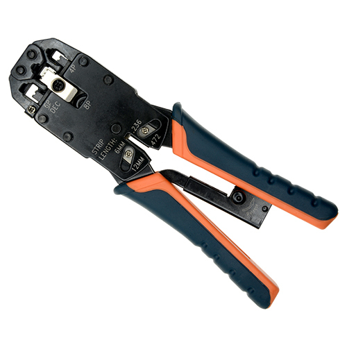
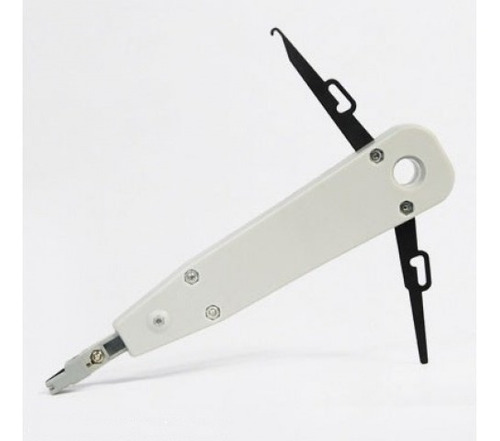
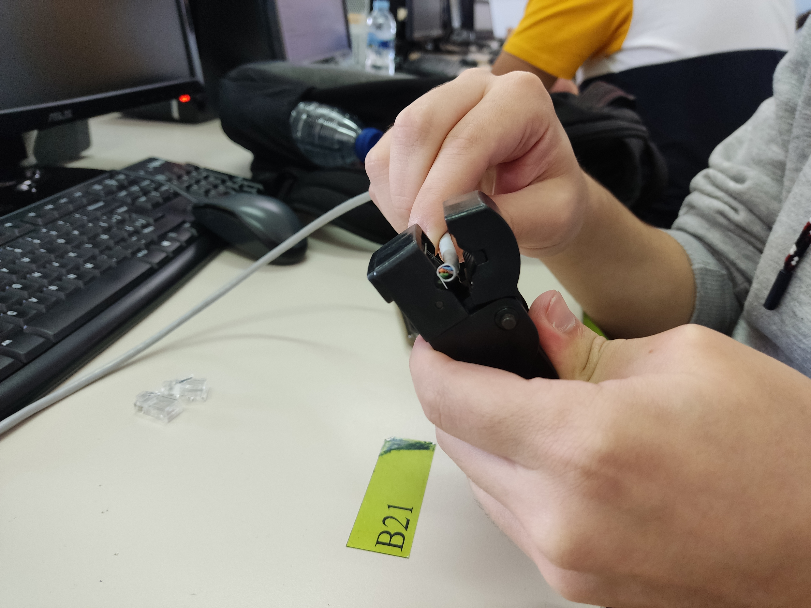

# UT4-A1 Construcción de cables UTP.

***Nombre:*** Cristian M. Hdez Cruellas 

***Curso:*** 1º de Ciclo Superior de Administración de Sistemas Informáticos en Red.

### ÍNDICE

+ [Introducción](#id1)
+ [Objetivos](#id2)
+ [Material empleado](#id3)
+ [Desarrollo](#id4)
+ [Conclusiones](#id5)

#### ***Introducción***. 

El <b>cable utp</b> es un cable el cual esta formado por un grupo de 4 hilos de par trenzado de cobre y todo esto recubierto por un material aislante. Hoy en día este tipo de cable es uno de los más usado en redes de área local. 

Cada par de cable es un conjunto de dos conductores aislados con un recubrimiento plástico. Este par se retuerce para que las señales transportadas por ambos conductores no generen interferencias ni resulten sensibles a emisiones.

La u de UTP indica que este cable es sin blindaje o no blindado. Esto quiere decir que este cable no incorpora ninguna malla metálica que rodee ninguno de sus elementos (pares) ni el cable mismo.

#### ***Objetivos***. 

En esta práctica se detallará como es el proceso de elaboración o construcción de un cable utp macho y un cable utp hembra. 

#### ***Material empleado***. 

El material que se necesita para realización de esta práctica son:

+ <b>Un cable utp</b>

+ <b>Un pelacables</b>       

+ <b>Dos cabezas de rj-45 macho</b>

+ <b> Una cabeza de rj-45 hembra</b>

+ <b> Una grimpadora </b>

+ <b> Una punchadora("Opcional") </b>

+ <b> Un cortarente </b>

#### ***Desarrollo***. 

En esta parte explicamos detalladamente los pasos que seguimos para realizar la práctica.

***Paso 1:Quitar revestimiento del cable***

*En este primer paso haremos uso del cable utp y el pelacables.* 

Cogemos el cable utp y con la ayuda del pelacables pelaremos el cable unos tres o cuatro centímetros como se muestra en la siguiente imagen.

Y  finalmente el cable nos quedará así:

***Paso 2:***

#### ***Conclusiones***. 

En esta parte debemos exponer las conclusiones que sacamos del desarrollo de la prácica.
