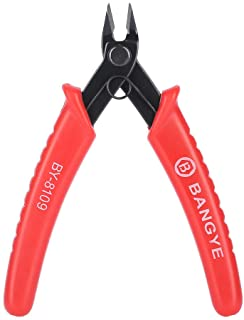

# UT4-A1 Construcción de cables UTP.

***Nombre:*** Cristian M. Hdez Cruellas 

***Curso:*** 1º de Ciclo Superior de Administración de Sistemas Informáticos en Red.

### ÍNDICE

+ [Introducción](#id1)
+ [Objetivos](#id2)
+ [Material empleado](#id3)
+ [Desarrollo](#id4)
+ [Conclusiones](#id5)

#### ***Introducción***. 

El <b>cable utp</b> es un cable el cual esta formado por un grupo de 4 hilos de par trenzado de cobre y todo esto recubierto por un material aislante. Hoy en día este tipo de cable es uno de los más usado en redes de área local. 

Cada par de cable es un conjunto de dos conductores aislados con un recubrimiento plástico. Este par se retuerce para que las señales transportadas por ambos conductores no generen interferencias ni resulten sensibles a emisiones.

Estos pares se suelen organizar en  2 diferentes configuraciones:

Configuración tipo *"A"* o *"cruzado"*

 Configuración tipo *"B"* o *"directo"* 

 

 
 El uso de una configuración u otra depende del tipo de uso que le vayamos a dar al cable el más frecuente es la configuración tipo "B"

La u de UTP indica que este cable es sin blindaje o no blindado. Esto quiere decir que este cable no incorpora ninguna malla metálica que rodee ninguno de sus elementos (pares) ni el cable mismo.

#### ***Objetivos***. 

En esta práctica se detallará  en un primer lugar como es el proceso de elaboración o construcción de un cable utp con rj-45 macho y luego se hará lo mismo con un cable utp rj-45 hembra. 

#### ***Material empleado***. 

El material que se necesita para realización de esta práctica son:

+ <b>Un cable utp</b>

+ <b>Un pelacables</b>    

+ <b>Dos cabezas de rj-45 macho</b>

+ <b> Una cabeza de rj-45 hembra</b>

+ <b> Una grimpadora </b>

+ <b> Una punchadora("Opcional") </b>

+ <b> Un cortarente </b>

+ <b> Un tester de cable rj-45 </b>

 

#### ***Desarrollo***. 

Como ya detallamos antes en un primer lugar detallaremos los pasos a seguir para la construcción de un cable rj-45 macho

#### **Construcción de un cable rj-45 macho**

*Todos los pasos que se realizan se deben en ambos extremos del cable*

***Paso 1: Quitar revestimiento del cable***

*En este primer paso haremos uso del cable utp y el pelacables.* 

Cogemos el cable utp y con la ayuda del pelacables pelaremos el cable unos tres o cuatro centímetros como se muestra en la siguiente imagen.

Y  finalmente el cable nos quedará así:

***Paso 2:Destrenzar cables***

*En este paso solo haremos uso del cable utp.* 

En este paso desenredamos cada par hasta que quede algo similar a esto:

***Paso 3: Organización de los colores de colores cables***

*En este paso solo haremos uso del cable utp.* 

En este paso organizaremos los pares para una configuración de tipo *B* que sería el siguiente orden de colores:

 

Y el cable nos quedará algo similar a la imagen anterior como se muestra a continuación:

 

Una vez comprobado a conciencia que el orden de colores de los cable es el correcto proseguiremos al siguiente paso.

***Paso 4: Recortar los hilos de los pares***

*En esta parte haremos uso del cable utp y de un cortarente.*

En este paso recortaremos con el contarente los hilos hasta que tenga una longitud aproximada de 1,2 cm como se muestra a continuación:

 

Volvemos a revisar a conciencia el orden de hilos del cable. 

***Paso 5: Colocación y grimpado del cabezal rj-45***

*En esta parte haremos uso del cable utp, los dos cabezales rj-45 y una grimpadora.*

Ahora introduciremos el cable utp en el interior del cabezal rj-45 hasta quede de la siguiente forma.

 

Volvemos a comprobar el orden de colores del cable y comprobamos si los hilos llegan al final del rj-45. La forma en la que yo lo compruebo es mirando desde la parte superior, como se muestra a continuación.

 

Una vez comprobado todo lo anterior grimpamos el cable con la grimpadora. 

 

Finalmente el cable quedaría tal que así.

 

***Paso 6:Comprobación del cable***

*En este paso haremos uso del cable finalizado con los dos rj-45 macho grimpado al cable utp y el tester de rj-45.*

Lo que haremos será conectar el cable al tester y en caso de que algún de los pines salga en rojo  el cable estaría mal realizado a continuación se muestra como funciona el tester.

#### **Construcción de un cable rj-45 hembra**

Ahora haremos con el cable de rj-45 que hemos hecho desecharemos un extremo de rj-45 macho  para realizar la contrucción del rj-45 hembra.

***Paso 1: Pelar y desenredar los hilos de cobre*** 

*En este paso se hace uso de un pelacables y un cable utp.*

Pelamos el cable con una longitud de unos 4 cm mas o menos y desenredamos los cables y quedará de una forma similar a esta 

**Paso 2: "Punchear" los cables con el rj-45 hembra**

*En esta parte se hace uso del conector rj-45 hembra, cable utp y en nuestro caso de forma opcional la punchadora.*

Para realizar la construcción de este conector tenemos que fijarnos al lateral del conector hembre y veremos que están los colores que debemos poner en cada caso como se muestra en la siguiente dos imágenes.
 

Y para realizar el cable lo primero que tenemos que poner la parte plástico como recubierta del cable y una vez que hayamos hecho ordenar los colores como se muestra a continuación. 

Una vez ordenados los hilos haremos presión sobre las dos partes plástica y se "punchearán" cerraremos la parte metálica como se muestra a continuación y el cable estaría listo.

***Paso 3: Comprobación del cable***

*En este paso se usará el cable con el conector macho y hembra, el tester y otro cable rj-45 para comprobar el correcto funcionamiento del conector hembra*

Ahora con el conector hembra ya hecho cogeremos otro cable rj-45 con los  dos conectores macho y se lo conectaremos al hembra, una vez hecho esto lo conectaremos al tester y lo comprobaremos com se muestra a continuación. 

Y con esto la práctica ya estaría realizada.

#### ***Conclusiones***. 

En mi opinión este tipo de práctica son realmente útiles porque se llegan a ver como funciona realmente toda la teoría que hemos dados aunque en este caso sea de una forma más básica y el único problema que tuvimos en esta práctica fue el estado de algunas herramientas a la hora realizar pero sustituyendolas por otra se soluciono dicho problema. 