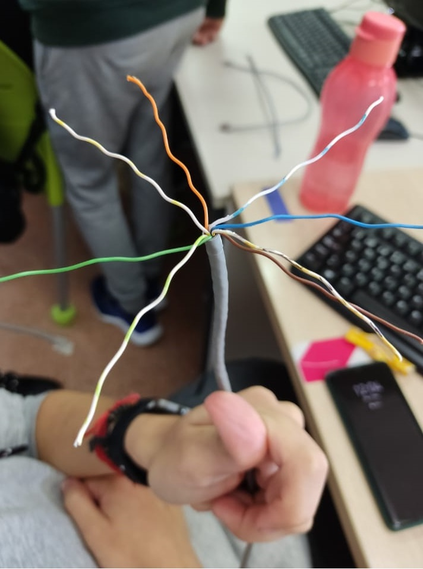

# TÍTULO DE LA PRÁCTICA

***Nombre:Cristian M. Hdez Cruellas***
***Curso:*** 1º de Ciclo Superior de Administración de Sistemas Informáticos en Red.

### ÍNDICE

+ [Introducción](#id1)
+ [Objetivos](#id2)
+ [Material empleado](#id3)
+ [Desarrollo](#id4)
+ [Conclusiones](#id5)

#### ***Introducción***. 

Antes de empezar la práctica haré una breve introducción sobre que es y para que sirve un panel de parcheo es una pieza de montaje de hardware con varios puertos para conectar y gestionar los cables LAN o los cables de fibra/cobre entrantes y salientes.

#### ***Objetivos***. 

En esta práctica haremos el conexionado de una panel de parcheo. 

#### ***Material empleado***. 

Enumeramos el material empleado tanto hardware como software y las conficuraciones que hacemos:

-Una punchadora.

-Un panel de parcheo.

-Dos cable rj45.

-(Opcional) Un destornillador plano. 

#### ***Desarrollo***. 

Comenzamos la práctica pelando uno de los cables rj45

Luego miramos una distribución de conexionado en nuestro caso la tipología "T568B"

Seguidamente aplicamos dicha distribución en el panel de parcheo para ello colocaremos los cables los ocho cables en el orden de colores y lo parchearemos con la parcheadora *("pero en nuestro caso la parcheadora no punchaba bien entonces decidí usar un destornillador plano como sustitutivo.")*

Y finalmente comprobamos el correcto funcionamiento. Haciendo un ping entre dos máquinas y ver que había respuesta. 

#### ***Conclusiones***. 

Esta práctica me ha ayudado a comprender mejor el funcionamiento de los conexionados hembras del rj45 y la unica dificultad que encontré fue el mal funcionamiento de las herramientas suministradas. 