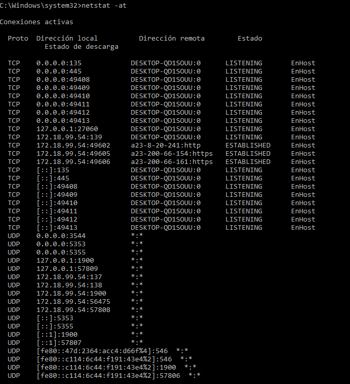

# TÍTULO DE LA PRÁCTICA

***Nombre:*** Cristian M. Hdez Cruellas
***Curso:*** 1º de Ciclo Superior de Administración de Sistemas Informáticos en Red.

### ÍNDICE

+ [Introducción](#id1)
+ [Objetivos](#id2)
+ [Material empleado](#id3)
+ [Desarrollo](#id4)
+ [Conclusiones](#id5)

#### ***Introducción***. 

Está práctica destinada a aprender, comprender algunos comandos importantes que
son de gran utilidad en la administración de una red.

#### ***Objetivos***. 

En esra práctica lo que garemos será comprobar la configuración, datos y como se modifica los sistema de red de una máquina virtual.

#### ***Material empleado***. 

Lo que usaremos para usar para esta práctica será:

-Servicio de redes disponible ("ya sea en clase o en mi casa").

-MV("Windows 10.")

-MV("Linux")

#### ***Desarrollo***. 

**Windows**

**Ejercicio 1.**

Use el comando ipconfig /all para ver la dirección MAC de tu equipo. Y la siguiente aplicación
http://coffer.com/mac_find/ para rellenar la siguiente tabla.

| Dirección IP v4               | 172.18.99.54                          |
|-------------------------------|---------------------------------------|
| Máscara                       | 255.255.0.0                           |
| Gateway                       | 255.255.0.0                           |
| MAC                           | 08-00-27-66-92-72                     |
| Fabricante                    | intel(r)pro/1000 MT Desktop Adapter   |
| Dirección IP v6               | fe80::c114:6c44:f191:43e4%2           |
| Servidores DNS                | 80.58.61.250                          |
| Tiempo de concesión de la IP  | jueves, 3 de febrero de 2022 13:19:26 |
| Nombre del adaptador de red | Ethernet Ethernet                     |

**Ejercicio 2**

Liberar la configuración IP del adaptador con ipconfig /release y a continuación volver a usar el
comando ipconfig.
¿Cuál es la ip ahora?

**Ejercicio 3**

Ejecutar el comando ipconfig /renew solicitando una renovación de dirección IP. A continuación
volver a ejecutar ipconfig. ¿Cuál es la nueva ip?

**Ejercicio 4**

Ejecutar el comando ipconfig /displaydns y comprobar la información que contiene la caché DNS
de tu equipo. Ejecuta ahora el comando ipconfig /flushdns y después muestra otra vez el
contenido de la caché DNS. ¿Qué información muestra ahora? ¿Qué ha ocurrido?

**Ejercicio 5**

Usar el navegador para ir a la web https://www.sportingnews.com/es/nba?gr=www y luego ejecutar el comando
ipconfig /displaydns. Hacer una captura de pantalla donde se muestre que se ha cacheado la ip de
ese nombre de dominio y pegarla aquí debajo.

**Ejercicio 6**

Borra la caché DNS con el comando ipconfig /flushdns y muestra una captura de pantalla en que
se vea que ya no hay registros DNS en caché.

**Linux**

**Ejercicio 1**

Ejecuta el comando ifconfig y rellena lo que puedas de la siguiente tabla.

| Dirección IP v4              | 192.168.1.1                         |
|------------------------------|-------------------------------------|
| Máscara                      | 255.255.255.192                     |
| Gateway                      | 192.168.1.63                        |
| MAC                          |                                     |
| Fabricante                   | intel(r)pro/1000 MT Desktop Adapter |
| Dirección IP v6              | 08:00:27:75:44:a3                   |
| Servidores DNS               |                                     |
| Tiempo de concesión de la IP |                                     |
| Nombre de adaptador de red   |                                     |

**Ejercicio 2**

Desactiva tu tarjeta de red con el comando ifconfig eth0 down. A continuación, comprueba con un
ifconfig que la tarjeta ya no aparece, se ha desactivado. Haz una captura de pantalla donde se vea
que ya no está activada.

**Ejercicio 3**

Usa el comando ifconfig eth0 192.168.99.99 netmask 255.255.255.0 y pega una captura de
pantalla que muestre que el adaptador de red se ha configurado correctamente.

**Ejercicio 4**

Usa el comando ifconfig eth0 IP netmask Máscara (con la configuración inicial de red) y pega una
captura de pantalla que muestre que el adaptador de red se ha configurado correctamente.

**Comando ping(Windows y Linux)**

**Ejercicio 1**

Desde una máquina con línux ejecuta el comando ping –s 100 –c 2 ip_puertadeenlace para que se
envíen dos ecos de 100 bytes. Muestra una captura de pantalla con el resultado.

**Ejercicio 2**

Desde una máquina con windows usa el comando ping –i 2 ip_puertadeenlace para hacer un ping
a nuestra puerta de enlace con un TTL igual a 2.
Luego haz un ping de las mismas características, pero a google ping –i 2 www.google.es. Pega una
captura de pantalla con el resultado y explica lo que ha pasado.

**Ejercicio 3**

El comando ping nos da información sobre el tiempo de latencia de una red. Haz un ping a nuestra
puerta de enlace y luego a otro a www.google.es. Busca información de lo que es el tiempo de
latencia y compara los tiempos de latencia en ambos casos.

- En mi caso no me muestra los tiempos de latencia al conectar al www.google.es asi que no los puedo comparar. 

**Comando route(Linux)**

**Ejercicio 1**

Usa el comando route para ver la puerta de enlace de tu equipo. ¿Cuál es tu puerta de enlace?

La puerta de enlace es 172.18.0.1 en este caso.

**Ejercicio 2**

Borra la puerta de enlace usando el comando Route del default gw ip_gateway. A continuación,
ejecuta el comando route para comprobar que ya no hay puerta de enlace. Intenta navegar por
internet y verás que tampoco puedes. Haz una captura de pantalla con la salida del comando
route y del resultado de ping 8.8.8.8 ¿Cómo interpretas el mensaje que te devuelve el ping?

Ahora podemos observar que no tenemos gateway.

Ahora probaremos hacer un ping y no podremos ya que no disponemos de gateway.

**Ejercicio 3**

Vuelve a configurar la puerta de enlace usando el comando route add default gw ip_gateway y
comprueba que ya ha vuelto la puerta de enlace con el comando route.

**Comandos netstat(linux y windows)**

**Ejercicio 1**

Abre una página web cualquiera y luego ejecuta el comando netstat -t para que nos muestre las
conexiones que tenemos abiertas por tcp. Pon una captura de pantalla del resultado y explica lo
que es cada una de las columnas que aparecen.

**Windows**

| Proto            | Muestra el tipo de protocolo que se usa en este caso "TCP"   |
|------------------|--------------------------------------------------------------|
| Direccion local  | Dirección ip de la máquina                                   |
| Direccion remota | direccion a la que conecta junto al protocolo "Http" que usa |
| estado           | si se establecio la conexión o no.                           |

**Linux**

| Proto           | Muestra el tipo de protocolo que se usa en este caso "TCP"                            |
|-----------------|---------------------------------------------------------------------------------------|
| Local Address   | Dirección ip de la máquina                                                            |
| foreign Address | direccion a la que conecta junto al protocolo "Http" que usa                          |
| state           | si se establecio la conexión o no.                                                    |
| send-Q          | El número de bytes que no se copian por el programa de usuario conectado a esta toma. |
| recv-Q          | El  número de bytes que no se reconoce por el host remoto.                            |

**Ejercicio 2**

Ahora espera unos segundos y vuelve a ejecutar netstat -tn. Comprobarás que algunas de las
conexiones se han cerrado o están esperando para cerrarse. Además con la opción -n verás los
resultados en formato numérico. Pon una captura de pantalla y explica la diferencia entre
Established, Time_wait y Close_Wait.

**Windows**

**Linux**

La diferencia es cuando el estado esta en Established es que la conexión esta establecida, time_wait esta cerrando la conexión pero todavia no la cerrado y close_wait cerro la conexión.

**Ejercicio 3**

Ejecuta ahora la orden netstat -at para que muestre las tanto las conexiones tcp abiertas como los
puertos que están a la escucha. Copia una captura de pantalla donde se vean los puertos que
tienes escuchando, explica qué significan los asteriscos en la columna “Foreign address” e investiga si tener esos puertos abiertos es normal o supone una amenaza

**Windows**

**Linux**

Los ateriscos que se muestran  significa que  la máquina local que esta esperando a recibir datos de una máquina remota. 

Tener los puertos abiertos en la gran mayoría de los casos suele ser peligroso por lo tanto no es recomendable tenerlos abierto. 

**Ejercicio 4**

Ejecuta el comando netstat -s para ver las estadísticas de red y haz una captura en la que se vean cuantos paquetes tcp has recibido y cuantos de ellos han sido erroneos.

Aqui ejecute el comando "netstat -s"

En mi caso concreto solo tuve un error de envio pero todos los segmentos fueron enviados. 

**Comando arp (Windows)**

**Ejercicio 1**

Borra toda la caché ARP con el comando arp -d *. A continuación haz un ping a la puerta de
enlace. Pon una captura de la tabla ARP en que se vea que solo está la puerta de enlace y su mac.

Al borrar la caché ARP y luego hacer un ping a la puerta de enlace solo queda registrada esta como se muestra a continuación. 

**Ejercicio 2**

Ahora borra manualmente la entrada arp de la puerta de enlace con la orden arp -d
ip_puertadeenlace. Luego introduce manualmente una mac falsa para la puerta de enlace en la tabla arp con el comando arp -s ip_puertadeenlace aa:bb:cc:dd:ee:ff Haz una captura de pantalla
en que se vea el resultado del comando arp -a y de hacer un ping a google. Explica por qué ahora no hay internet.

Ejecutamos el arp -d y a continuación arp -s y luego me aparecio la ip inventada en la tabla. 

A continuación intentamos hacer ping pero nos dará error ya que no esta correctamente configurada y si esta no esta configurada no se podrá navegar.

**Comando nslookup**

**Ejercicio 1**

Averigua el nombre del servidor DNS de www.iespuertodelacruz.es. A continuación, ejecutamos
el comando nslookup nombreServidorDNS y luego el comando nslookup nombreServidorDNS
8.8.8.8. Explica las causas de las diferencias que hay entre los resultados de las dos consultas.

Ejecutamos el nslookup www.iespuertodelacruz.es 

Ahora ejecutamos el mismo comando pero con 8.8.8.8

Lo que se diferencia uno de otra es el servidor que utiliza para acceder a la página. 

#### ***Conclusiones***. 

Esta práctica te ayuda mucho a comprender de mejor manera como se comportan las redes y como se pueden modificar para configurarlas. 