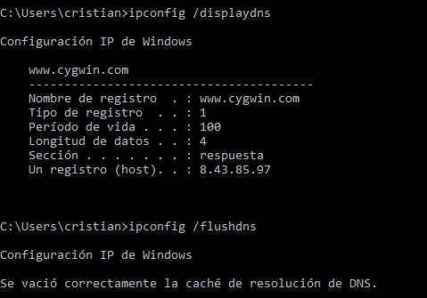

# TÍTULO DE LA PRÁCTICA

***Nombre:*** Cristian M. Hdez Cruellas
***Curso:*** 1º de Ciclo Superior de Administración de Sistemas Informáticos en Red.

### ÍNDICE

+ [Introducción](#id1)
+ [Objetivos](#id2)
+ [Material empleado](#id3)
+ [Desarrollo](#id4)
+ [Conclusiones](#id5)

#### ***Introducción***. 

Está práctica destinada a aprender, comprender algunos comandos importantes que
son de gran utilidad en la administración de una red.

#### ***Objetivos***. 

En esra práctica lo que garemos será comprobar la configuración, datos y como se modifica los sistema de red de una máquina virtual.

#### ***Material empleado***. 

Lo que usaremos para usar para esta práctica será:

-Servicio de redes disponible ("ya sea en clase o en mi casa").

-MV("Windows 10.")

-MV("Linux")

#### ***Desarrollo***. 

**Windows**

**Ejercicio 1.**

Use el comando ipconfig /all para ver la dirección MAC de tu equipo. Y la siguiente aplicación
http://coffer.com/mac_find/ para rellenar la siguiente tabla.

| Dirección IP v4               | 172.18.99.54                          |
|-------------------------------|---------------------------------------|
| Máscara                       | 255.255.0.0                           |
| Gateway                       | 255.255.0.0                           |
| MAC                           | 08-00-27-66-92-72                     |
| Fabricante                    | intel(r)pro/1000 MT Desktop Adapter   |
| Dirección IP v6               | fe80::c114:6c44:f191:43e4%2           |
| Servidores DNS                | 80.58.61.250                          |
| Tiempo de concesión de la IP  | jueves, 3 de febrero de 2022 13:19:26 |
| Nombre del adaptador de red | Ethernet Ethernet                     |

**Ejercicio 2**

Liberar la configuración IP del adaptador con ipconfig /release y a continuación volver a usar el
comando ipconfig.
¿Cuál es la ip ahora?

**Ejercicio 3**

Ejecutar el comando ipconfig /renew solicitando una renovación de dirección IP. A continuación
volver a ejecutar ipconfig. ¿Cuál es la nueva ip?

**Ejercicio 4**

Ejecutar el comando ipconfig /displaydns y comprobar la información que contiene la caché DNS
de tu equipo. Ejecuta ahora el comando ipconfig /flushdns y después muestra otra vez el
contenido de la caché DNS. ¿Qué información muestra ahora? ¿Qué ha ocurrido?

**Ejercicio 5**

Usar el navegador para ir a la web https://www.sportingnews.com/es/nba?gr=www y luego ejecutar el comando
ipconfig /displaydns. Hacer una captura de pantalla donde se muestre que se ha cacheado la ip de
ese nombre de dominio y pegarla aquí debajo.

**Ejercicio 6**

Borra la caché DNS con el comando ipconfig /flushdns y muestra una captura de pantalla en que
se vea que ya no hay registros DNS en caché.

**Linux**

**Ejercicio 1**

Ejecuta el comando ifconfig y rellena lo que puedas de la siguiente tabla.

| Dirección IP v4              | 192.168.1.1                         |
|------------------------------|-------------------------------------|
| Máscara                      | 255.255.255.192                     |
| Gateway                      | 192.168.1.63                        |
| MAC                          |                                     |
| Fabricante                   | intel(r)pro/1000 MT Desktop Adapter |
| Dirección IP v6              | 08:00:27:75:44:a3                   |
| Servidores DNS               |                                     |
| Tiempo de concesión de la IP |                                     |
| Nombre de adaptador de red   |                                     |

**Ejercicio 2**

Desactiva tu tarjeta de red con el comando ifconfig eth0 down. A continuación, comprueba con un
ifconfig que la tarjeta ya no aparece, se ha desactivado. Haz una captura de pantalla donde se vea
que ya no está activada.

**Ejercicio 3**

Usa el comando ifconfig eth0 192.168.99.99 netmask 255.255.255.0 y pega una captura de
pantalla que muestre que el adaptador de red se ha configurado correctamente.

**Ejercicio 4**

Usa el comando ifconfig eth0 IP netmask Máscara (con la configuración inicial de red) y pega una
captura de pantalla que muestre que el adaptador de red se ha configurado correctamente.

**Comando ping(Windows y Linux)**

**Ejercicio 1**

Desde una máquina con línux ejecuta el comando ping –s 100 –c 2 ip_puertadeenlace para que se
envíen dos ecos de 100 bytes. Muestra una captura de pantalla con el resultado.

**Ejercicio 2**

Desde una máquina con windows usa el comando ping –i 2 ip_puertadeenlace para hacer un ping
a nuestra puerta de enlace con un TTL igual a 2.
Luego haz un ping de las mismas características, pero a google ping –i 2 www.google.es. Pega una
captura de pantalla con el resultado y explica lo que ha pasado.

#### ***Conclusiones***. 