

# Packet tracert I

***Nombre:*** Cristian M. Hdez Cruellas

***Curso:*** 1º de Ciclo Superior de Administración de Sistemas Informáticos en Red.

### ÍNDICE

+ [Introducción](#id1)
+ [Objetivos](#id2)
+ [Material empleado](#id3)
+ [Desarrollo](#id4)
+ [Conclusiones](#id5)

#### ***Introducción***. 

 Utilizaremos el programa de packet tracert que es un programa que simula intalaciones de infracturas en red.  

#### ***Objetivos***. 

En esta práctica realizaremos unos ejercicios de prácticos de packet tracert para comprender mejor su funcionamiento.

#### ***Material empleado***. 

Utilizamos el programa de packet tracert. 

#### ***Desarrollo***. 

***Ejercicio 1: ***

Realizar un ping, desde la máquina virtual, a las siguientes direcciones, 
comprobando los mensajes que devuelven cada uno de ellos. Se recomienda analizar 
porque se produce cada respuesta:
• 192.168.1.250

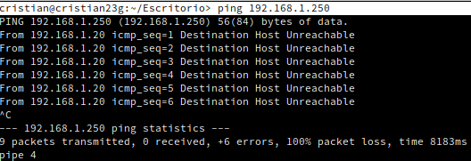

• 172.20.1.2

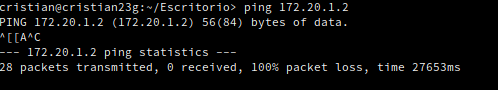

• www.google.es (responde)

• www.gobiernodecanarias.org (tiempo de espera agotado, pero traduce)

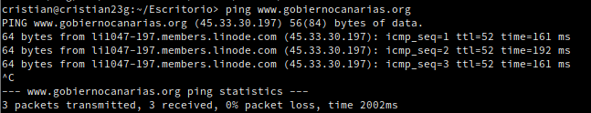

• www.educacion.es (tiempo de espera agotado, pero traduce)

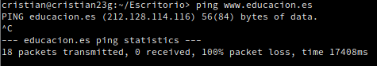

• www.iespuertodelacruz.com (dirección no existente)

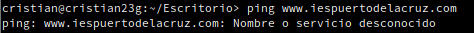

• leela.servido

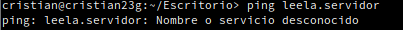

 ***Ejercicio 2. Tipos de cables en uniones entre equipos.***

Vamos a verificar los cables que se necesitan colocar, utilizando par trenzado, en la comunicación entre diferentes dispositivos.

**Paso 1.** Unión de un PC con otro. Utilizar el cable adecuando de par trenzado hasta que se produzca comunicación (luces en verde en ambos extremos).

**Paso 2.** Unión de un PC con un switch (utilizaremos un 2950‐24 para todas las experiencias). Utilizar el cable adecuando de par trenzado hasta que se produzca comunicación (luces en verde en ambos extremos).

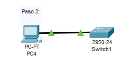

**Paso 3.** Unión de un switch con otro. Utilizar el cable adecuando de par trenzado hasta que se produzca comunicación (luces en verde en ambos extremos).

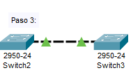

**Paso 4.** Unión de un PC con un router (utilizaremos el 1841 en todas las experiencias). Utilizar el cable adecuando de par trenzado hasta que se produzca comunicación (luces en verde en ambos extremos).

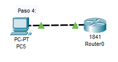

**Paso 5.** Unión de un switch con un router. Utilizar el cable adecuando de par trenzado hasta que se produzca comunicación (luces en verde en ambos extremos).

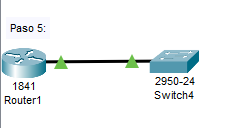

**Paso 6.** Unión de un switch con un hub (utilizaremos el HUB‐PT). Utilizar el cable adecuando de par trenzado hasta que se produzca comunicación (luces en verde en ambos extremos)

***Ejercicio 3. Diferencias entre Hub y Switch.***

En esta primera práctica intentaremos ver la diferencia entre Switch y Hub. Para ello realizaremos las siguientes acciones:

**Paso1.** Añadimos un Generic Hub‐PT, que nos presenta un pequeño hub con 6 puertos Fast Ethernet.

**Paso 2.** Añadimos 3 ordenadores con las siguientes configuraciones:

| Nombre| Dirección IP| Máscara de red |
|-------|-------------|----------------|
| PC01  |192.168.5.101 | 255.255.255.0   |   
| PC02  |192.168.5.102 |255.255.255.0   |  
| PC03  | 192.168.5.103 |255.255.255.0   |   

**Paso 3.** Conectar los 3 equipos con el hub utilizando el cableado adecuado.

**Paso 4.** Comprobar la conectividad entre los equipos realizando un ping entre ellos.

**Paso 5.** Una vez comprobada la conectividad, pasar del modo Tiempo Real al modo simulación y volver a realizar un ping entre equipos. Se debe reiniciar la configuración para poder apreciar los paquetes ICMP entre los equipos. Para realizar correctamente esta experiencia, y no tener más información que la necesaria, aplicar un filtro de eventos que sólo nos presente los paquetes ARP e ICMP (que son los necesarios para comprobar el funcionamiento del ping). Comprobar también tablas ARP aprendidas,
ejecutando el comando arp -a en uno de los equipos.

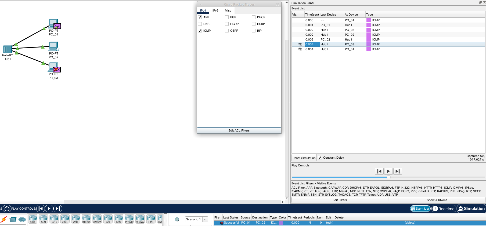

**Paso 6.** Realizar las mismas pruebas cambiando el Generic Hub‐PT por un switch 2950‐24. Grabar el proyecto con un nuevo nombre. Comprobar la diferencia entre ambas 
experiencias.

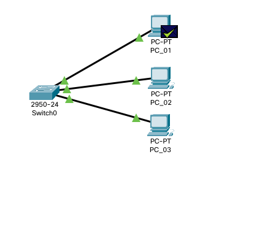

#### ***Conclusiones***. 

En esta parte debemos exponer las conclusiones que sacamos del desarrollo de la prácica.