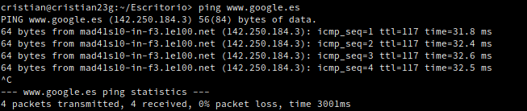
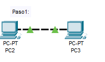
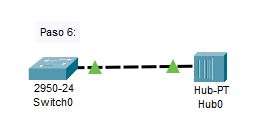

# Packet tracert I

***Nombre:*** Cristian M. Hdez Cruellas

***Curso:*** 1º de Ciclo Superior de Administración de Sistemas Informáticos en Red.

### ÍNDICE

+ [Introducción](#id1)
+ [Objetivos](#id2)
+ [Material empleado](#id3)
+ [Desarrollo](#id4)
+ [Conclusiones](#id5)

#### ***Introducción***. 

 Utilizaremos el programa de packet tracert que es un programa que simula intalaciones de infracturas en red.  

#### ***Objetivos***. 

En esta práctica realizaremos unos ejercicios de prácticos de packet tracert para comprender mejor su funcionamiento.

#### ***Material empleado***. 

Utilizamos el programa de packet tracert. 

#### ***Desarrollo***. 

Ejercicio 1: 

Realizar un ping, desde la máquina virtual, a las siguientes direcciones, 
comprobando los mensajes que devuelven cada uno de ellos. Se recomienda analizar 
porque se produce cada respuesta:
• 192.168.1.250

• 172.20.1.2

• www.google.es (responde)

• www.gobiernodecanarias.org (tiempo de espera agotado, pero traduce)

• www.educacion.es (tiempo de espera agotado, pero traduce)

• www.iespuertodelacruz.com (dirección no existente)

• leela.servido

 *** Ejercicio 2. Tipos de cables en uniones entre equipos.***

Vamos a verificar los cables que se necesitan colocar, utilizando par trenzado, en la comunicación entre diferentes dispositivos.

**Paso 1.** Unión de un PC con otro. Utilizar el cable adecuando de par trenzado hasta que se produzca comunicación (luces en verde en ambos extremos).

**Paso 2.** Unión de un PC con un switch (utilizaremos un 2950‐24 para todas las experiencias). Utilizar el cable adecuando de par trenzado hasta que se produzca comunicación (luces en verde en ambos extremos).

**Paso 3.** Unión de un switch con otro. Utilizar el cable adecuando de par trenzado hasta que se produzca comunicación (luces en verde en ambos extremos).

**Paso 4.** Unión de un PC con un router (utilizaremos el 1841 en todas las experiencias). Utilizar el cable adecuando de par trenzado hasta que se produzca comunicación (luces en verde en ambos extremos).

**Paso 5.** Unión de un switch con un router. Utilizar el cable adecuando de par trenzado hasta que se produzca comunicación (luces en verde en ambos extremos).

**Paso 6.** Unión de un switch con un hub (utilizaremos el HUB‐PT). Utilizar el cable adecuando de par trenzado hasta que se produzca comunicación (luces en verde en ambos extremos)

#### ***Conclusiones***. 

En esta parte debemos exponer las conclusiones que sacamos del desarrollo de la prácica.