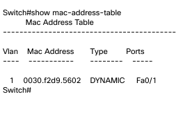
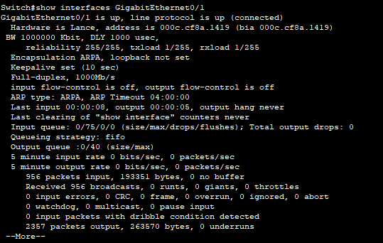
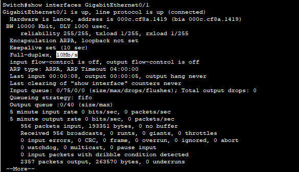
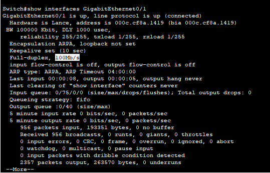
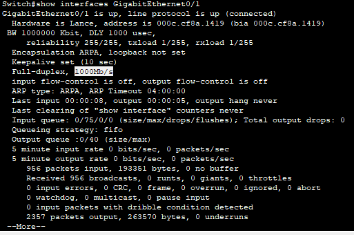
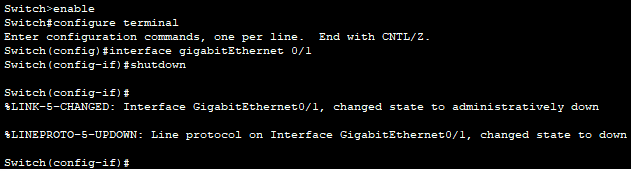

# PACKET TRACERT II

***Nombre:*** Cristian M. Hdez Cruellas

***Curso:*** 1º de Ciclo Superior de Administración de Sistemas Informáticos en Red.

### ÍNDICE

+ [Introducción](#id1)
+ [Objetivos](#id2)
+ [Material empleado](#id3)
+ [Desarrollo](#id4)
+ [Conclusiones](#id5)

#### ***Introducción***. 

 Utilizaremos el programa de packet tracert que es un programa que simula intalaciones de infracturas en red.  

#### ***Objetivos***. 

En esta práctica realizaremos unos ejercicios de prácticos de packet tracert para comprender mejor su funcionamiento.

#### ***Material empleado***. 

Utilizamos el programa de packet tracert. 

#### ***Desarrollo***. 

***Ejercicio 5. Direccionamiento IP.***

Partiendo de una configuración de 3 switchs y 15 equipos, comprobar la comunicación 
entre los equipos mediante el uso de direcciones IP y máscaras.

***Paso 1.*** Insertar tres switchs 2950‐24 con los nombres SW01, SW02 y SW03, con la 
siguiente configuración:

| Switch origen |Puerto origen | Switch destino | Puerto destino |
|---------------|--------------|----------------|--------------|
| SW01| 2 | SW02 | 1          |                                   
| SW01| 3 | SW03 | 1          |                                   

***Paso 2.*** Insertar los 15 equipos con la siguiente configuración:

| Nombre | IP            | Máscara         | Switch | Puerto | último octeto | subredes | ip válidas                  |
|--------|---------------|-----------------|--------|--------|---------------|----------|-----------------------------|
| PC01   | 192.168.1.101 | 255.255.255.0   | SW01   | 11     | 00000000      | 1        | 192.168.1.1-192.168.1.254   |
| PC02   | 192.168.1.121 | 255.255.255.248 | SW02   | 11     | 11111000      | 32       | 192.168.1.121-192.168.1.127 |
| PC03   | 192.168.1.140 | 255.255.255.192 | SW03   | 11     | 11000000      | 4        | 192.168.1.129-192.168.1.191 |
| PC04   | 192.168.1.160 | 255.255.255.128 | SW01   | 12     | 10000000      | 2        | 192.168.1.129-192.168.1.254 |
| PC05   | 192.168.1.1   | 255.255.255.0   | SW02   | 12     | 00000000      | 1        | 192.168.1.1-192.168.1.254   |
| PC06   | 192.168.1.11  | 255.255.255.224 | SW03   | 12     | 11100000      | 8        | 192.168.1.1-192.168.1.31    |
| PC07   | 192.168.1.111 | 255.255.255.128 | SW01   | 13     | 10000000      | 2        | 192.168.1.1-192.168.1.127   |
| PC08   | 192.168.1.200 | 255.255.255.240 | SW02   | 13     | 11110000      | 16       | 192.168.1.193-192.168.1.207 |
| PC09   | 192.168.1.201 | 255.255.255.0   | SW03   | 13     | 00000000      | 1        | 192.168.1.1-192.168.1.254   |
| PC10   | 192.168.1.248 | 255.255.255.128 | SW01   | 14     | 10000000      | 2        | 192.168.1.1.-192.168.1.254  |
| PC11   | 192.168.1.144 | 255.255.255.192 | SW02   | 14     | 11000000      | 4        | 192.168.1.129-192.168.1.191 |
| PC12   | 192.168.1.211 | 255.255.255.240 | SW03   | 14     | 11110000      | 16       | 192.168.1.209-192.168.1.223 |
| PC13   | 192.168.1.25  | 255.255.255.128 | SW01   | 15     | 10000000      | 2        | 192.168.1.1-192.168.1.127   |
| PC14   | 192.168.1.33  | 255.255.255.224 | SW02   | 15     | 11100000      | 8        | 192.168.1.33-192.168.1.63   |
| PC15   | 192.168.1.222 | 255.255.255.0   | SW03   | 15     | 00000000      | 1        | 192.168.1.1-192.168.1.254   |

***Paso 3.*** 

Calcular, de forma manual, qué equipos se comunican entre ellos. 
Comprobar estos cálculos con los aportados por las comunicaciones del ejemplo.

| Nombre | IP            | Máscara         | Switch | Puerto | último octeto | subredes | ip válidas                  | Pc al que se conecta          |
|--------|---------------|-----------------|--------|--------|---------------|----------|-----------------------------|-------------------------------|
| PC01   | 192.168.1.101 | 255.255.255.0   | SW01   | 11     | 00000000      | 1        | 192.168.1.1-192.168.1.254   | pc05,pc07,pc09,pc15           |
| PC02   | 192.168.1.121 | 255.255.255.248 | SW02   | 11     | 11111000      | 32       | 192.168.1.121-192.168.1.127 | Ninguno                       |
| PC03   | 192.168.1.140 | 255.255.255.192 | SW03   | 11     | 11000000      | 4        | 192.168.1.129-192.168.1.191 | pc04, pc11                    |
| PC04   | 192.168.1.160 | 255.255.255.128 | SW01   | 12     | 10000000      | 2        | 192.168.1.129-192.168.1.254 | pc03,pc09,pc10,pc11,pc16      |
| PC05   | 192.168.1.1   | 255.255.255.0   | SW02   | 12     | 00000000      | 1        | 192.168.1.1-192.168.1.254   | pc01,pc06,pc07,pc09,pc15      |
| PC06   | 192.168.1.11  | 255.255.255.224 | SW03   | 12     | 11100000      | 8        | 192.168.1.1-192.168.1.31    | pc05,pc13                     |
| PC07   | 192.168.1.111 | 255.255.255.128 | SW01   | 13     | 10000000      | 2        | 192.168.1.1-192.168.1.127   | pc13                          |
| PC08   | 192.168.1.200 | 255.255.255.240 | SW02   | 13     | 11110000      | 16       | 192.168.1.193-192.168.1.207 | pc09                          |
| PC09   | 192.168.1.201 | 255.255.255.0   | SW03   | 13     | 00000000      | 1        | 192.168.1.1-192.168.1.254   | pc04,pc08,pc10,pc15           |
| PC10   | 192.168.1.248 | 255.255.255.128 | SW01   | 14     | 10000000      | 2        | 192.168.1.1.-192.168.1.254  | pc04,pc09,pc15                |
| PC11   | 192.168.1.144 | 255.255.255.192 | SW02   | 14     | 11000000      | 4        | 192.168.1.129-192.168.1.191 | pc03,pc04                     |
| PC12   | 192.168.1.211 | 255.255.255.240 | SW03   | 14     | 11110000      | 16       | 192.168.1.209-192.168.1.223 | pc15                          |
| PC13   | 192.168.1.25  | 255.255.255.128 | SW01   | 15     | 10000000      | 2        | 192.168.1.1-192.168.1.127   | pc07                          |
| PC14   | 192.168.1.33  | 255.255.255.224 | SW02   | 15     | 11100000      | 8        | 192.168.1.33-192.168.1.63   | Ninguno                       |
| PC15   | 192.168.1.222 | 255.255.255.0   | SW03   | 15     | 00000000      | 1        | 192.168.1.1-192.168.1.254   | pc01.pc04,pc05,pc09,pc10,pc12 |

***Paso 4.*** 

Comprobar las direcciones MAC que 
ha aprendido cada uno de los switchs. Para ello, 
entramos en el modo consola de cada uno de 
los switchs

***Ejercicio 7.Configuración de puertos.*** 

Durante el uso de un switch, y por problemas con los equipos o las tarjetas de red, 
puede ser interesante el poder gestionar los puertos sin tener que tocar los cables. 
Veamos los cambios más frecuentes que podemos realizar sobre un puerto.

***Paso 1.Auto‐negociación o fijado de velocidad.***

Esta configuración la haremos utilizando el switch 2950T que posee dos puertos 
Gigabit. En el PC que utilicemos vamos a colocar, en lugar de la tarjeta estándar que 
viene, una tarjeta de par trenzado Gigabit. De esta forma tendremos una unión entre 
el switch y el PC a Gigabit.
Veamos cual es la situación normal del puerto: 

***Switch# show interfaces GigabitEthernet0/1***

Esto devuelve:

De esta forma comprobamos la velocidad del puerto. 
Si queremos cambiarla, utilizamos los comandos:

***Switch# configure terminal***

***Switch(config)#interface gigabitEthernet0/1*** 

***Switch(config‐if)#speed 10***

Y comprobamos que, ahora, la velocidad de nuestro puerto a cambia a 10 Mbps.

***Switch# show interfaces GigabitEthernet0/1***

Podemos hacer lo mismo colocando la velocidad a 100: 

***Switch(config)#interface gigabitEthernet0/1***

***Switch(config‐if)#speed 100***

O volviendo a colocar la velocidad en automático: 

***Switch(config)#interface gigabitEthernet0/1***

***Switch(config‐if)#speed auto***

***Paso 2. Desactivar un puerto.***

Hay momentos en que podremos necesitar el desactivar un puerto, ya sea porque la 
tarjeta de red del equipo no funciona correctamente, o por haber detectado que quien 
hace uso de ese puerto no está autorizado.
Por este motivo, podemos desactivar un puerto.
Partiendo de la configuración anterior, podemos desactivar cualquier puerto del 
switch. Esta acción la conseguimos con los comandos:

***Switch>enable***

***Switch#configure terminal***

***Switch(config)#interface gigabitEthernet0/1***

***Switch(config‐if)#shutdown***

#### ***Conclusiones***. 

No entendí casi nada a la hora de realizar las prácticas y es demasiado contenido para el escaso tiempo que nos dio para completarlas.