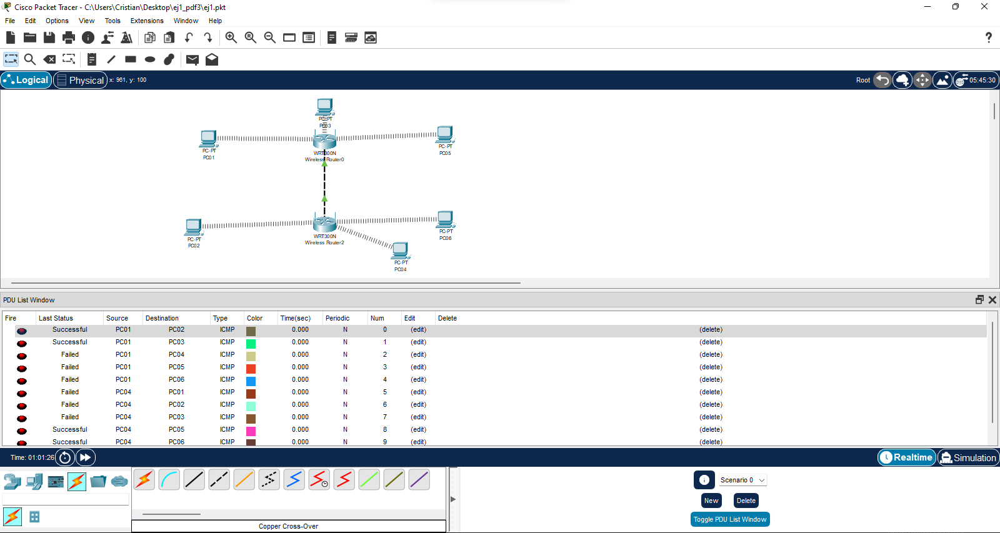
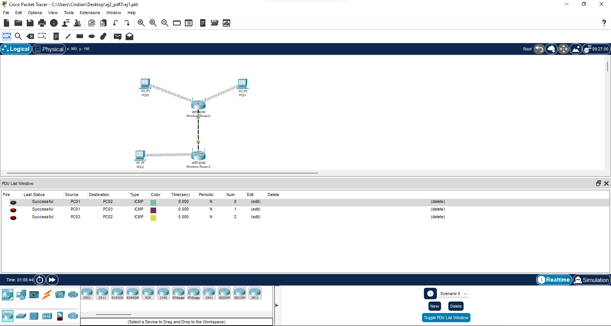

# Packet tracert III

***Nombre:*** Cristian M. Hdez Cruellas

***Curso:*** 1º de Ciclo Superior de Administración de Sistemas Informáticos en Red.

### ÍNDICE

+ [Introducción](#id1)
+ [Objetivos](#id2)
+ [Material empleado](#id3)
+ [Desarrollo](#id4)
+ [Conclusiones](#id5)

#### ***Introducción***. 

 Utilizaremos el programa de packet tracert que es un programa que simula intalaciones de infracturas en red.  

#### ***Objetivos***. 

En esta práctica realizaremos unos ejercicios de prácticos de packet tracert para comprender mejor su funcionamiento.

#### ***Material empleado***. 

Utilizamos el programa de packet tracert. 

#### ***Desarrollo***. 

***Ejercicio 1. Inalámbrico. Red Abierta.***

Realicemos una configuración de una red inalámbrica sin seguridad.

***Paso 1.*** Insertar un dispositivo inalámbrico Linksys WRT300N (Punto de acceso). Por 
defecto, este equipo viene con la configuración 192.168.0.1 y máscara de red 
255.255.255.0. Debemos colocar la configuración con la IP 192.168.1.1 y máscara de 
red 255.255.255.0. Además, debemos desactivar la asignación de direcciones 
mediante DHCP en el dispositivo inalámbrico.

***Paso 2.*** Insertar tres PC’s inalámbricos, con las siguientes configuraciones:

| Nombre| Dirección IP| Máscara de red |   |   |
|------|--------------|---------------|---|---|
| PC01| 192.168.1.11 | 255.255.255.0   |   |   |
| PC02 |192.168.1.12 | 255.255.255.0   |   |   |
| PC03| 192.168.1.13 | 255.255.255.0   |   |   |

Comprobar que el SSID de todos los equipos insertados es Default.

***Paso 3.*** Comprobar la comunicación entre los diferentes PC’s, y su comunicación con 
el punto de acceso. Observar esta comunicación en el modo simulación. ¿A qué te 
recuerda este tipo de propagación de tramas?

***Paso 4.*** Cambia la configuración de los equipos:

| Nombre| Dirección IP| Máscara de red |   |   |
|-------|-------------|----------------|---|---|
| PC01 | 192.168.101.11| 255.255.255.0  |   |   |
| PC02| 192.168.101.12 |255.255.255.0  |   |   |
| PC03| 192.168.101.13| 255.255.255.0  |   |   |

***Paso 5.*** Comprobar la comunicación entre los diferentes PC’s, y su comunicación con 
el punto de acceso. Como podemos comprobar, la configuración IP del punto de 
acceso no impide una correcta comunicación entre los diferentes PC’s que se conecten 
a su red

***Ejercicio 2. Inalámbricas: varios puntos de acceso.***

Comprobar la interacción de varios puntos de acceso en una misma red (ya que en una 
red distinta sería crear inalámbricas aisladas).

***Paso 1.*** 

Insertar dos dispositivos inalámbricos Linksys WRT300N (Punto de acceso). 
Cambiar la configuración por defecto a 192.168.1.1 y máscara de red 255.255.255.0 y 
192.168.2.1 y máscara de red 255.255.255.0.

***Paso 2.*** 

Cambiar el SSID de las redes:

| IP          | SSID |   |
|-------------|------|---|
| 192.168.1.1 | RED1 |   |
| 192.168.2.1 | RED2 |   |

| Nombre| Dirección IP| Máscara de red | SSID |   |   |   |
|------|------------|------------------|-----|---|---|---|
| PC01| 172.16.1.1 |255.255.255.0 |RED1      |   |   |   |
| PC02| 172.16.1.2 |255.255.255.0 |RED2      |   |   |   |
| PC03 |172.16.1.3 |255.255.255.0 |RED1      |   |   |   |
| PC04 |172.16.2.1 |255.255.255.0 |RED2      |   |   |   |
| PC05 |172.16.2.2 |255.255.255.0 |RED1      |   |   |   |
| PC06 |172.16.2.3 |255.255.255.0 |RED2      |   |   |   |

***Paso 4.*** 

Conectar entre sí ambos puntos de acceso por el puerto Ethernet 1.

***Paso 5.*** 

Comprobar las comunicaciones entre los seis PC’s, verificando que las 
comunicaciones no dependen de la red inalámbrica a la que se conecten, sino que 
configuran el punto de acceso al que se conectan.

***Ejercicio 3. Inalámbrico: Red cifrado WEP.***

Comprobar las funcionalidades de una red con cifrado mediante WEP.

***Paso 1.***

 Insertar dos dispositivos inalámbricos Linksys WRT300N (Punto de acceso). 
Cambiar su configuración a 192.168.1.1 y máscara de red 255.255.255.0 y 192.168.2.1 
y máscara de red 255.255.255.0.

***Paso 2.*** 

Cambiar el SSID de las redes:

| IP          | SSID |   |
|-------------|------|---|
| 192.168.1.1 | RED1 |   |
| 192.168.2.1 | RED2 |   |

***Paso 3.***

 Introducir clave WEP en el punto de acceso de la RED1: clave WEP 0123456789.

***Paso 4.***

 Insertar tres PC’s con las siguientes configuraciones:

| Nombre| Dirección IP| Máscara de red | SSID |   |   |   |
|------|------------|------------------|-----|---|---|---|
| PC01| 172.16.100.1 |255.255.255.0 |RED1      |   |   |   |
| PC02| 172.16.100.2 |255.255.255.0 |RED2      |   |   |   |
| PC03 |172.16.100.3 |255.255.255.0 |RED1      |   |   |   |

Comprobar la conectividad entre los equipos, cambiando la configuración WEP de los 
equipos.

***Ejercicio 4. Inalámbrico: DHCP.***

***Paso 1.*** 

Insertar dos dispositivos inalámbricos Linksys WRT300N (Punto de acceso). 
Colocar la configuración a 192.168.1.1 y máscara de red 255.255.255.0 y 192.168.2.1 y máscara de red 255.255.255.0

***Paso 2.***

 Cambiar el SSID de las redes:

| IP          | SSID |   |
|-------------|------|---|
| 192.168.1.1 | RED1 |   |
| 192.168.2.1 | RED2 |   |

Al colocar cada uno de los equipos a una SSID, adquiere una dirección DHCP del punto 
de acceso correspondiente.

**Paso 3.**

 Comprobar la configuración DHCP de los puntos de acceso para comprobar 
qué direcciones reparte cada uno de ellos.

**Paso 4.** 

Insertar cuatro PC’s con la siguiente configuración:

| Nombre          | SSID |   |
|-------------|------|---|
| PC01 | RED1 |   |
| PC02 | RED2 |   |
|PC03|RED1|
|PC04|RED2|

***Paso 5.*** 

Cambiar el PC01 de RED1 a RED2. **¿Cambia su dirección IP?**

- No cambia su ip. 

#### ***Conclusiones***. 

No entendí casi nada a la hora de realizar las prácticas y es demasiado contenido para el escaso tiempo que nos dio para completarlas.
