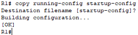

# CISCO PACKET TRACERT III

***Nombre:*** Cristian M. Hdez Cruellas
***Curso:*** 2º de Ciclo Superior de Administración de Sistemas Informáticos en Red.

### ÍNDICE

+ [Introducción](#Introducción)
+ [Objetivos](#Objetivos)
+ [Material empleado](#Material_empleado)
+ [Desarrollo](#Desarrollo)
+ [Conclusiones](#Conclusiones)

## Introducción. 

Esta es una práctica de laboratorio integral para revisar comandos de router de IOS.

## Objetivos. 

En esta práctica realizará el cableado de los equipos y completará las configuraciones básicas y las configuraciones de las interfaces IPv4 en el router.

Además se utilizará SSH para conectarse de manera remota al router y usará comandos de IOS para recuperar la información del dispositivo para responder preguntas sobre el router.

## Material empleado. 

Los recursos necesarios para la realización de la práctica:

- 1 router (Cisco 1941 con IOS de Cisco versión 15.2(4)M3, imagen universal o similar)
- 1 switch (Cisco 2960 con IOS de Cisco versión 15.0(2), imagen lanbasek9 o comparable)
- computadoras (Windows 7, Vista o XP con un programa de emulación de terminal, como Tera Term)
- Cables de consola para configurar los dispositivos con IOS de Cisco mediante los puertos de consola
 Cables Ethernet, como se muestra en la topología

## Desarrollo. 

### Parte 1: Establecer la topología e inicializar los dispositivos.
**Paso 1:realizar el cableado de red tal como se muestra en la topología**

### Parte 2: Configurar dispositivos y verificar la conectividad.

**Paso 1:Configure las interfaces de la PC.**

- PC-A

- PC-B

**Paso 2. Configurar el router.**

a. Acceda al router mediante el puerto de consola y habilite el modo EXEC privilegiado.

b. Ingrese al modo de configuración global.

c. Asigne un nombre de dispositivo al router.

d. Deshabilite la búsqueda DNS para evitar que el router intente traducir los comandos incorrectamente 
introducidos como si fueran nombres de host.

e. Establezca el requisito de que todas las contraseñas tengan como mínimo 10 caracteres.

Además de configurar una longitud mínima, enumere otras formas de aportar seguridad a las 
contraseñas.

- Aparte de que las podemos encriptar es necesario que estas contraseñas contenga letras mayúsculas, números o caracteres para así dificultar la contraseña.

f. Asigne cisco12345 como la contraseña cifrada del modo EXEC privilegiado.

g. Asigne ciscoconpass como la contraseña de consola, establezca un tiempo de espera, habilite el inicio 
de sesión y agregue el comando logging synchronous. El comando logging synchronous sincroniza la depuración y el resultado del software IOS de Cisco, y evita que estos mensajes interrumpan la entrada del teclado.

Para el comando exec-timeout, ¿qué representan el 5 y el 0?

- Que la sesion expia en 5 minutos y 0 segundos.

h. Asigne ciscovtypass como la contraseña de vty, establezca un tiempo de espera, habilite el inicio de sesión y agregue el comando logging synchronous.

i.  Cifre las contraseñas de texto no cifrado.

j. Cree un aviso que advierta a todo el que acceda al dispositivo que el acceso no autorizado está 
prohibido.

k. Configure una dirección IP y una descripción de interfaz. Active las dos interfaces en el router.

l. Configure el reloj en el router, por ejemplo:

m. Guarde la configuración en ejecución en el archivo de configuración de inicio.

¿Qué resultado obtendría al volver a cargar el router antes de completar el comando copy running-config startup-config?

- Se nos borraría toda la configuración que le hemos realizado al router ya que no tendría configuración de inicio *(startup-config)*.

**Paso 3: Verificar la conectividad de la red**

a. Haga ping a la PC-B en un símbolo del sistema en la PC-A.

¿Fueron correctos los pings?

- Si

Después de completar esta serie de comandos, ¿qué tipo de acceso remoto podría usarse para acceder 
al R1?

- Telnet de Tera Term.

b. Acceda de forma remota al R1 desde la PC-A mediante el cliente de Telnet de Tera Term.
Abra Tera Term e ingrese la dirección IP de la interfaz G0/1 de R1 en el campo Host: de la ventana Tera 
Term: New Connection (Tera Term: Conexión nueva). Asegúrese de que el botón de opción Telnet esté 
seleccionado y después haga clic en OK (Aceptar) para conectarse al router.

¿Pudo conectarse remotamente?

- Si 

¿Por qué el protocolo Telnet es considerado un riesgo de seguridad?

- Porque no cifra las contraseñas y con un programa externo podría averiguarse. 

**Paso 4: configurar el router para el acceso por SSH.**

a. Habilite las conexiones SSH y cree un usuario en la base de datos local del router.

¿Pudo conectarse remotamente?

- Si

### Parte 3: mostrar la información del router

**Paso 1. establecer una sesión SSH para el R1.**
Mediante Tera Term en la PC-B, abra una sesión SSH para el R1 en la dirección IP `192.168.0.1` e inicie 
sesión como admin y use la contraseña `adminpass1`.

**Paso 2. recuperar información importante del hardware y el software.**
a. Use el comando show version para responder preguntas sobre el router.
¿Cuál es el nombre de la imagen de IOS que el router está ejecutando?

- IOS (tm) PT1000 Software (PT1000-I-M)

¿Cuánta memoria de acceso aleatorio no volátil (NVRAM) tiene el router?

- 32K bytes

¿Cuánta memoria flash tiene el router?

- 63488K bytes

b. Con frecuencia, los comandos `show` proporcionan varias pantallas de resultados. Filtrar el resultado permite que un usuario visualice determinadas secciones del resultado. Para habilitar el comando de filtrado, introduzca una barra vertical (|) después de un comando `show`, seguido de un parámetro de filtrado y una expresión de filtrado. Para que el resultado coincida con la instrucción de filtrado, puede 
usar la palabra clave `include` para ver todas las líneas del resultado que contienen la expresión de filtrado. Filtre el comando `show` version mediante show version | include register para responder la siguiente pregunta.

¿Cuál es el proceso de arranque para el router en la siguiente recarga?

- Configuration register is 0x2102

**Paso 3: mostrar la configuración de inicio.**
Use el comando `show startup-config` en el router para responder las siguientes preguntas.
¿De qué forma figuran las contraseñas en el resultado?

- Se encuentra cifrada. 

Use el comando `show startup-config | begin vty.` 
¿Qué resultado se obtiene al usar este comando?

- Por el startup-config | begin vty no aparece nada pero usando en el running-config | begin vty aparece esto. 

**Paso 4: Mostrar la tabla de routing en el router.**
Utilice el comando `show ip route` en el router para responder las preguntas siguientes:
¿Qué código se utiliza en la tabla de routing para indicar una red conectada directamente?

- Con el carácter *"C"* inica que ips están conectadas.

¿Cuántas entradas de ruta están codificadas con un código C en la tabla de routing?

- 2

**Paso 5: mostrar una lista de resumen de las interfaces del router.**
Use el comando show ip interface brief en el router para responder la siguiente pregunta.
¿Qué comando cambió el estado de los puertos Gigabit Ethernet de administrativamente inactivo a activo?

- El comando para cambiar el estado  es el comando *"no shutdown"*.

**Parte 4: configurar IPv6 y verificar la conectividad**

Paso 1: asignar direcciones IPv6 a la G0/0 del R1 y habilitar el routing IPv6.

a. Asigne una dirección de unidifusión global IPv6 a la interfaz G0/0; asigne la dirección link-local en la 
interfaz, además de la dirección de unidifusión; y habilite el routing IPv6.

## Reflexión 

1. Durante la investigación de un problema de conectividad de red, un técnico sospecha que no se habilitó una 
interfaz. ¿Qué comando show podría usar el técnico para resolver este problema?

- Con el uso del comando `show startup-config`

2. Durante la investigación de un problema de conectividad de red, un técnico sospecha que se asignó una 
máscara de subred incorrecta a una interfaz. ¿Qué comando show podría usar el técnico para resolver este 
problema?

- Con los comando `show startup-config` o `show running-config`.

## Conclusiones. 

Esta práctica me sirvió para comprender mejor el uso de los comandos en el packet tracert. 
